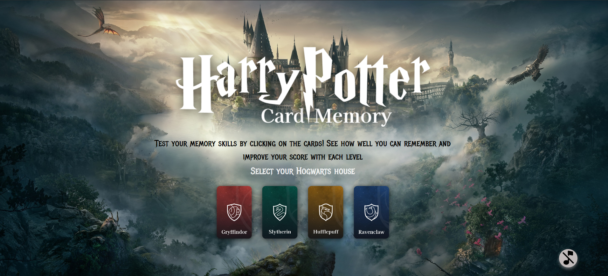

# Memory-card

## This project is developed with React.js
It was created as part of [The Odin Project](https://www.theodinproject.com) course. 
In this project, I continued learning about useState, explored useEffect, and worked with an API([The Harry Potter API](https://www.potterapi.com)).

 The main goal of this project was to build a memory card game using React (especially hooks and lifecycle methods). The game consists of five levels of difficulty, in which in each level, the user must click on all images exactly once. When the user clicks on an image, the cards are all randomly redistributed. If the user clicks on the same image twice, the game ends. The user can then restart the game, with their best result being saved.

## Live Demo
You can view the live version of the project [here](https://memory-card-vlad-petruks-projects.vercel.app/).

## Skills Practiced
- React (including state management with useState and useEffect)
- API Integration (working with The Harry Potter API)
- CSS

## Screenshots

